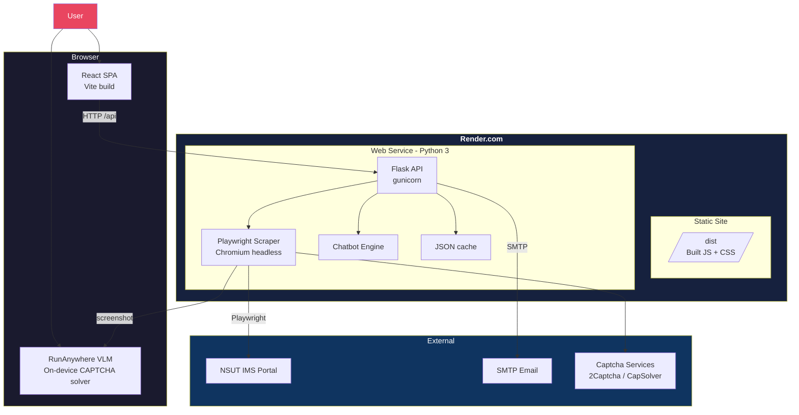
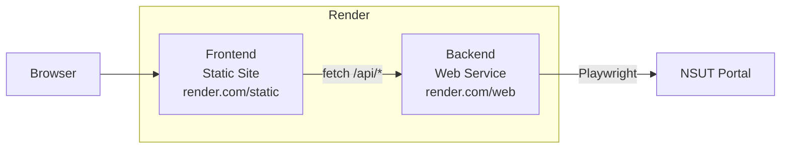

# Kairon — NSUT Smart Attendance Assistant

> Production-grade attendance analytics for NSUT. Scrapes the IMS portal, solves CAPTCHAs (manual / OCR / on-device AI vision), and provides real-time dashboards with trends, predictions, and a conversational AI assistant.

Built by [vicky kjumar](https://github.com/fiscalmindset) — [LinkedIn](https://linkedin.com/in/algsoch) — npdimagine@gmail.com

---

## Features

- **Smart semester detection** — tries ALL year/semester combos, uses JS injection to force-select options not in the portal dropdown
- **AI CAPTCHA solving** — manual entry, Tesseract OCR ensemble, or on-device vision (RunAnywhere Web SDK VLM)
- **Cookie reuse** — skip CAPTCHA for 72h after first solve via persisted Playwright cookies
- **Interactive dashboard** — subject/date filters, cumulative trend chart, comparison bars with safe/watch/risk status
- **Chat assistant** — natural-language queries (HI, TOTAL, ABSENT, PLAN, RISK, PROFILE) and subject code lookups
- **Data science** — trend series, consistency scoring, next-N-class predictions
- **Email notifications** — full login success/failure alerts with password, CAPTCHA, and debug info
- **Anti-detection** — Playwright stealth patches randomizing viewport, user agent, locale, timezone

---

## Architecture



### Data flow

1. User opens React SPA → fetches `/api/config` to check cache status
2. On login: Flask launches headless Chromium → navigates to NSUT IMS → fills credentials
3. CAPTCHA image is sent to frontend → user solves (manual / OCR / AI vision)
4. Solved CAPTCHA is submitted → Playwright completes login → scrapes ALL year/semester combos
5. Attendance parsed, analyzed (trends, predictions, consistency scores), cached to JSON
6. Frontend dashboard renders charts, tables; chat assistant answers natural-language queries

---

## Quick Start (Development)

### Prerequisites

| Tool | Version |
|---|---|
| Python | 3.12+ |
| Node.js | 20+ |
| npm | 10+ |

### 1. Clone & install

```bash
git clone <repo> && cd Kairon

# Backend
python3.12 -m venv venv
source venv/bin/activate
pip install -r backend/requirements.txt
playwright install chromium

# Frontend
cd frontend && npm install && cd ..
```

### 2. Configure

```bash
cp .env.example .env
# Edit .env with your NSUT credentials (see below)
```

### 3. Run

**Terminal 1 — Backend:**
```bash
PORT=5001 venv/bin/python backend/app.py
```

**Terminal 2 — Frontend** (auto-opens at `localhost:5173`):
```bash
cd frontend && npm run dev
```

Vite proxies `/api/*` to `http://localhost:5001` during development. See `.env.development`.

### 4. Production build (local)

```bash
cd frontend && npm run build && cd ..
PORT=5001 venv/bin/python backend/app.py
# Open http://localhost:5001
```

Flask automatically serves `frontend/dist/` when `index.html` exists.

---

## Environment Variables

### File locations

| File | Purpose | Git |
|---|---|---|
| `.env` (root) | Dev convenience — Flask reads this first | ❌ gitignored |
| `backend/.env` | **Production** — Flask overrides root `.env` values | ❌ gitignored |
| `backend/.env.example` | Template for `backend/.env` | ✅ committed |
| `frontend/.env.development` | Vite dev mode — proxy target, port | ✅ committed |
| `frontend/.env.production` | Vite build mode — `VITE_API_BASE_URL` | ✅ committed |
| `.env.example` | Template for root `.env` | ✅ committed |

Flask loads `.env` files in order (later overrides): root `.env` → `backend/.env`.

### Variables

| Variable | Set in | Default | Required | Description |
|---|---|---|---|---|
| `PORT` | `.env` / `backend/.env` | `5001` | | Flask server port |
| `roll_no` | `.env` / `backend/.env` | — | yes | NSUT roll number |
| `password` | `.env` / `backend/.env` | — | yes | NSUT portal password |
| `stmp_email` | `.env` / `backend/.env` | — | | SMTP sender |
| `stmp_password` | `.env` / `backend/.env` | — | | SMTP app password |
| `PLAYWRIGHT_BROWSERS_PATH` | `backend/.env` | `0` | | Playwright browser path (Render) |
| `VITE_API_PROXY_TARGET` | `frontend/.env.development` | `http://localhost:5001` | | Vite dev proxy backend URL |
| `FRONTEND_PORT` | `frontend/.env.development` | `5173` | | Vite dev server port |
| `VITE_API_BASE_URL` | `frontend/.env.production` | — | yes* | Backend URL for production build |

> *`VITE_API_BASE_URL` is required in production. It tells the static frontend where the Flask API lives. Baked into the JS bundle at build time.

### Vite env loading order

Vite loads these files in order (later files override earlier ones):

1. `frontend/.env` (not committed — for local overrides)
2. `frontend/.env.development` or `frontend/.env.production` (committed — environment templates)
3. Root `.env` (loaded by Flask; `VITE_*` vars visible to Vite)

Only variables prefixed with `VITE_` are exposed to the client bundle.

---

## Deploy to Render

Two **separate** Render services are required — the frontend is a static site, the backend is a Python web service.



### Service 1: Backend (Web Service)

| Setting | Value |
|---|---|
| **Runtime** | Python 3 |
| **Root Directory** | `backend/` |
| **Build Command** | `pip install -r requirements.txt && PLAYWRIGHT_BROWSERS_PATH=0 python -m playwright install chromium` |
| **Start Command** | `gunicorn -w 1 -b 0.0.0.0:$PORT app:app` |
| **Health Check** | `/api/coral/health` |

**Environment variables:**

Set these in Render dashboard, or commit a `backend/.env` file (Render doesn't support file upload in the dashboard — use the dashboard env vars instead):

| Variable | Value |
|---|---|
| `PLAYWRIGHT_BROWSERS_PATH` | `0` |
| `roll_no` | your NSUT roll number |
| `password` | your NSUT portal password |

> `PLAYWRIGHT_BROWSERS_PATH=0` makes Playwright download Chromium to its own package directory instead of system paths. Omit `--with-deps` — Render's Docker image includes the necessary system libraries.

> `-w 1` gunicorn worker only — multiple workers each launch their own Chromium, exhausting memory.

### Service 2: Frontend (Static Site)

| Setting | Value |
|---|---|
| **Root Directory** | `frontend/` |
| **Build Command** | `npm install && npm run build` |
| **Publish Directory** | `dist` |
| **Routes** | `/*` → `index.html` (SPA fallback) |

**Required env vars:**

| Variable | Value |
|---|---|
| `VITE_API_BASE_URL` | `https://your-backend.onrender.com/api` |

> This tells the frontend where the backend lives. Without it, the browser tries `fetch('/api/...')` against the static site's own domain, which fails.

### How frontend-backend connection works

```
Browser                          Frontend Static Site          Backend Web Service
 │                                     │                             │
 │  fetch('/api/login') ───────────────┤                             │
 │                                     │  no server-side proxy       │
 │                                     │  (static files only!)       │
 │  ✗ 404                             │                             │
 │                                     │                             │
 │  fetch('https://bs.onrender.com/api/login')                       │
 │  ──────────────────────────────────────────────────────────────→  │
 │  ←─ JSON response ─────────────────────────────────────────────── │
```

**Without `VITE_API_BASE_URL`**: the browser sends `/api/*` requests to the static site's origin → 404 (static server has no `/api` routes).

**With `VITE_API_BASE_URL`**: the frontend JS uses the full backend URL, so the browser sends requests directly to the backend web service. CORS is enabled on the backend (`flask-cors` allows all origins).

Set `VITE_API_BASE_URL` in `frontend/.env.production` **before building** — Vite inlines environment variables at build time.

---

## API Endpoints

### Core

| Method | Path | Description |
|---|---|---|
| `GET` | `/api/config` | App config, cached data status, default rollno |
| `POST` | `/api/login` | Start login — returns CAPTCHA image in base64 |
| `POST` | `/api/captcha` | Submit solved CAPTCHA, triggers full scrape |
| `POST` | `/api/captcha/refresh` | Get a new CAPTCHA image |
| `POST` | `/api/check_cache` | Load previously cached attendance data |
| `POST` | `/api/chat` | Send message to chatbot assistant |
| `POST` | `/api/analysis` | Get raw full analysis JSON |
| `POST` | `/api/cookies/status` | Check if saved cookies are still valid |
| `POST` | `/api/cookies/clear` | Delete saved session cookies |

### Coral (machine-readable)

| Method | Path | Returns |
|---|---|---|
| `GET` | `/api/coral/health` | Server health + active session count |
| `GET` | `/api/coral/sessions` | All active sessions with metadata |
| `GET` | `/api/coral/attendance_subjects` | Subject-wise attendance rows |
| `GET` | `/api/coral/attendance_days` | Day-wise attendance records |
| `GET` | `/api/coral/session_summary` | Aggregated per-session summary |
| `GET` | `/api/coral/student_profile` | Student name, degree, department, semester |
| `GET` | `/api/coral/synced_filters` | Year/semester filters that returned data |
| `GET` | `/api/coral/portal_surfaces` | Portal sections discovered (attendance, profile, etc.) |
| `GET` | `/api/coral/portal_links` | Links found across portal pages |
| `GET` | `/api/coral/status_legend` | Attendance status code legend |
| `GET` | `/api/coral/attendance_marks` | Special attendance marks (OD, ML, etc.) |

---

## Project Structure

```
Kairon/
├── .env                          # Root env — NSUT credentials, SMTP, Flask port
├── .gitignore
├── README.md
├── .env.example                  # Template for local dev (root .env)
├── backend/
│   ├── .env.example              # Template for production (backend/.env)
│   ├── app.py                    # Flask API routes + production frontend serving
│   ├── scraper.py                # Playwright scraper, CAPTCHA, attendance parser
│   ├── chatbot.py                # Chatbot Q&A engine
│   ├── email_notifier.py         # SMTP success/failure notifications
│   ├── playwright_manager.py     # Chromium lifecycle management
│   ├── logging_config.py         # Structured logging setup
│   ├── cookie_store.py           # Persisted Playwright cookies
│   ├── captcha_solver.py         # 2Captcha / CapSolver integration
│   ├── stealth.py                # Anti-bot-detection patches
│   ├── requirements.txt
│   ├── data/                     # JSON cache (gitignored)
│   ├── cookies/                  # Playwright cookie files (gitignored)
│   └── scrape/                   # Debug screenshots + HTML (gitignored)
├── frontend/
│   ├── .env.development          # Vite dev env — proxy target, port
│   ├── .env.production           # Vite prod env — API_BASE_URL
│   ├── package.json
│   ├── vite.config.js
│   ├── index.html
│   ├── css/main.css              # All styles — glassmorphism, responsive
│   └── src/
│       ├── main.jsx              # React DOM entry
│       ├── App.jsx               # Root — session lifecycle, layout
│       ├── components/
│       │   ├── LoginView.jsx     # Login form + CAPTCHA + AI Solve button
│       │   ├── ChatView.jsx      # Chat interface + dashboard
│       │   ├── Dashboard.jsx     # Filters, trend chart, subject bars, tables
│       │   └── Promotion.jsx     # Creator ad panel (top-right floating)
│       └── services/
│           ├── api.js            # Fetch wrapper — reads VITE_API_BASE_URL
│           └── vlmSolver.js      # RunAnyhere VLM on-device CAPTCHA solver
└── venv/                         # Python virtual environment (gitignored)
```

---

## Troubleshooting

| Problem | Cause & Fix |
|---|---|
| `Port 5001 in use` | macOS Control Center uses port 5000. Set `PORT=5002` in `.env` or `lsof -ti:5001 \| xargs kill` |
| `Playwright not found` | Run `venv/bin/python -m playwright install chromium` |
| `ModuleNotFoundError` | `pip install -r backend/requirements.txt` or activate venv |
| `Session expired` | Sessions last ~5 min. Login again — cookies may still be valid |
| `Semester 1/2 no data` | Portal dropdown only shows the current academic year. The scraper now uses JS injection to try older years anyway |
| `PROFILE shows Unknown` | Portal renders profile in a non-standard layout. The scraper now searches all frames with div/dl/text pattern matching |
| `Photo not loading` | Photo element may be below the minimum 30×30 threshold or outside expected frames |
| `Vite proxy not working` | Ensure `VITE_API_PROXY_TARGET` in `.env` or `frontend/.env.development` matches your Flask port |
| `CORS errors on Render` | Set `VITE_API_BASE_URL` to the full backend URL before building the frontend |
| `Build fails: playwright install` | Use `PLAYWRIGHT_BROWSERS_PATH=0` and drop `--with-deps` on Render |

---

## License

MIT License. See [LICENSE](./LICENSE).
