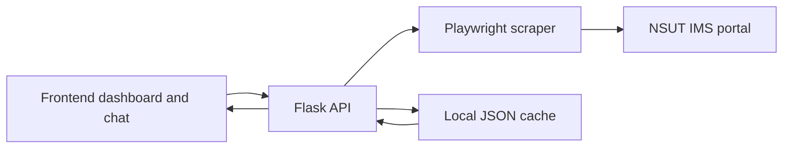

# Kairon: NSUT Smart Attendance Assistant

Kairon is a Flask + Playwright attendance assistant for the NSUT IMS portal. It logs in with a human-entered CAPTCHA, extracts attendance/profile/timetable surfaces, caches the latest analysis locally, and turns the data into a dashboard plus shortcut-based chatbot.

The app is built for a student workflow: connect once, solve CAPTCHA, then reopen the assistant from cache until the portal data needs a fresh sync.

## What It Shows

- Student profile card with name, full local roll number, degree, department, semester, academic year, and portal photo when captured.
- Overall attendance, total present, total absent, safe skips at 75 percent, and risk subject count.
- Subject percentage bar chart with the 75 percent threshold.
- Cumulative attendance trend line from day-wise portal marks.
- Filterable subject table with code, subject, status, percentage, present, total, absent, action, and latest mark.
- Portal surfaces summary for menu sections, ID-card fields, registered courses, timetable tables, and attendance data.
- Chat commands for quick answers: `HI`, `SW`, `TOTAL`, `ABSENT`, `SAFE`, `RISK`, `PROFILE`, `CALENDAR`, `WEBSITE`, and subject codes.

## Privacy

Runtime cache files in `backend/data/` and debug scrape artifacts in `backend/scrape/` can contain real student data. Keep them local and do not commit them.

Docs and PR text should use fake examples such as `2024ABC0000`. The local app can show the logged-in student their own full roll number and portal photo, but public documentation should not expose real identifiers.

## Architecture



The frontend is served by Flask, so local development and Render deployment use one web service.

## Project Structure

```text
Kairon/
├── backend/
│   ├── app.py
│   ├── chatbot.py
│   ├── scraper.py
│   ├── logging_config.py
│   ├── requirements.txt
│   ├── data/        # local cache, do not commit
│   └── scrape/      # debug artifacts, do not commit
├── frontend/
│   ├── index.html
│   ├── css/main.css
│   └── js/app.js
├── render.yaml
├── render.md
├── session.md
├── requirements.txt
└── README.md
```

## Local Setup

Use Python 3.12 or newer.

```bash
python3.12 -m venv .venv
source .venv/bin/activate
.venv/bin/python -m pip install --upgrade pip setuptools wheel
.venv/bin/python -m pip install -r backend/requirements.txt
.venv/bin/python -m playwright install chromium
```

Create `.env` in the repo root:

```env
roll_no=2024ABC0000
password=your_portal_password
```

Run the app:

```bash
PORT=5000 .venv/bin/python backend/app.py
```

If port `5000` is busy, the local server automatically chooses another free port and prints it at startup.

## Login Flow

1. The app checks `/api/config` and tries `/api/check_cache`.
2. If a valid cache exists, the assistant opens immediately.
3. If no cache exists or the user wants fresh data, the backend starts a Playwright portal session.
4. The frontend displays the portal CAPTCHA.
5. The student submits CAPTCHA.
6. The scraper extracts profile, photo, attendance, day-wise marks, menu links, course/timetable tables when available, and saves the new analysis payload.

More detail is in [session.md](session.md).

## Cache Behavior

The app does not poll the portal in the background. It loads the local cache first because this avoids repeated CAPTCHA prompts. When the real portal changes, do a fresh login + CAPTCHA to rebuild the local cache.

Logout only returns to the login screen. It does not delete `backend/data/<rollno>.json`.

If a live portal sync succeeds but the portal returns an empty attendance report, the assistant can keep the last valid local cache available and show a warning instead of dropping into a dead empty state.

## API Endpoints

### GET `/api/config`

Returns app version, default roll from `.env`, saved-password flag, and cache status.

### POST `/api/check_cache`

Loads cached analysis for a roll number.

```json
{
  "rollno": "2024ABC0000"
}
```

### POST `/api/login`

Starts a portal login session and returns CAPTCHA.

```json
{
  "rollno": "2024ABC0000",
  "password": "your_password"
}
```

### POST `/api/captcha`

Submits CAPTCHA and performs the portal scrape.

```json
{
  "session_id": "uuid-string",
  "captcha": "ABC123"
}
```

### POST `/api/captcha/refresh`

Refreshes the CAPTCHA for the active login session.

### POST `/api/chat`

Sends a shortcut or question to the attendance assistant.

```json
{
  "session_id": "uuid-string",
  "message": "PROFILE"
}
```

### POST `/api/analysis`

Returns the structured analysis payload for the active session.

## Chat Commands

| Command | Response |
|:---|:---|
| `HI` | Overall summary, risk/safe context, and subject table |
| `SW` | Subject-wise list and detail selection |
| `TOTAL` | Overall present/total/absent numbers |
| `ABSENT` | Recent absences and absence counts |
| `SAFE` | Subjects with skip buffer at 75 percent |
| `RISK` | Borderline or below-threshold subjects |
| `PROFILE` | Student profile fields captured from portal/cache |
| `CALENDAR` | Portal marks such as GH, TL, CS, MB, MS |
| `WEBSITE` | Authenticated portal sections discovered after login |
| subject code | Subject-specific detail table |

## Render Deployment

This repo includes `render.yaml` for a single Render Web Service. The service builds Python dependencies, installs Chromium for Playwright, and starts Flask through Gunicorn.

Required Render secrets:

- `roll_no`
- `password`

Those are marked with `sync: false` in `render.yaml`, so Render prompts for them during Blueprint setup instead of reading them from git.

See [render.md](render.md) for Mermaid diagrams and deployment notes.

## Validation

Useful local checks:

```bash
node --check frontend/js/app.js
PYTHONDONTWRITEBYTECODE=1 .venv/bin/python -m py_compile backend/app.py backend/scraper.py backend/chatbot.py
```

For UI changes, run the app and verify:

- Desktop split layout keeps the assistant panel on the right.
- Tablet layout stacks charts cleanly.
- Mobile layout becomes a natural vertical page instead of cramped nested scroll panels.
- Subject search and status filter update the table.
- Profile card does not show course-table rows as student fields.

## Troubleshooting

### CAPTCHA expires

Use the CAPTCHA refresh button and submit the newest image.

### Portal returns no attendance records

Check the debug folder printed by the alert under `backend/scrape/<session_id>`. If a previous cache exists, the assistant can load the last valid cache with a warning.

### Playwright browser is missing

```bash
.venv/bin/python -m playwright install chromium
```

### Render build fails around Chromium

Make sure `render.yaml` includes:

```yaml
PLAYWRIGHT_BROWSERS_PATH: 0
```

and the build command runs:

```bash
python -m playwright install chromium
```

### Port already in use locally

Set another port:

```bash
PORT=55217 .venv/bin/python backend/app.py
```
